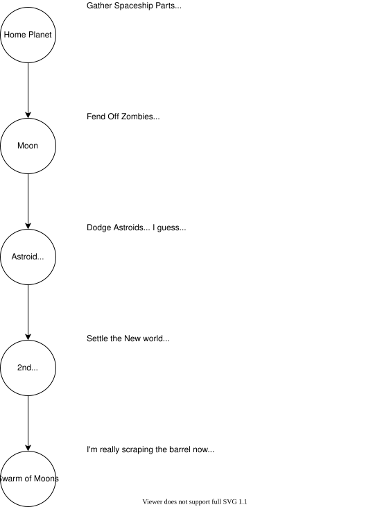

# Bad Spaceship

You planet is doomed!

Nothing can save you now except your feeble witts,
so you'd better do something!

Quick! You must escape to the moonbase where it is surely safe.

# Philosophy

Bad Spaceship is fundamentally a game about chasing that unatainable "something" missing from all the other video games.
Our rather, running from all the problems that modern gaming has produced.
Stuff that annoys us, like:

- Competitive advantages as reward for competitive success.
  It's like a runaway chain reaction of oppression for anyone just trying to enjoy a game.
  There's basically two schools of thought: Call of Duty and Mariokart.
  We prefer Mariokart. ⭐
- Sniping while strafing.
  It's just not a thing.
  Keeping your upper body perfectly stable while your feet wildly move you back and forth in random directions?
  Moves like that would make Michael Jackson jealous.
  Instead, player movement is goverened by the laws of physics! 🤯
- Memorizing maps and then camping in all the cheap spots.
  We all do it,
  but only because devs are too lazy to supply an infinite flow of new maps.
  That's why our maps our all procedurally generated. 👍
- Getting penalized for just plain bad luck.
  That's why we have invented a system called Karma™,
  where all the bad things that happen to you are eventually balanced out by the good! 😇

...you get the idea.

# How does it work?

You begine life as a lemming, completing various tasks that need doing "for the greater good",
well, specifically your own good.
You're basically a red-shirt in a mosh pit, climbing over your comrades to survive at _all_ costs.

Eventually you gain enough experience and reputation to take a more important role in your society:
scheming to acquire more material wealth.
This is ultimately accomplished by packing as many potential survivors onto spaceships as possible,
in hopes of someday farming their labor for your guacamole fund.

We're not allowed to talk about the people higher up...

# How do I escape?

## Escape as a Lemming

Let's just assume you're the bottom of the totem-pole.
If you're lucky, life for you will turn out something like this:

